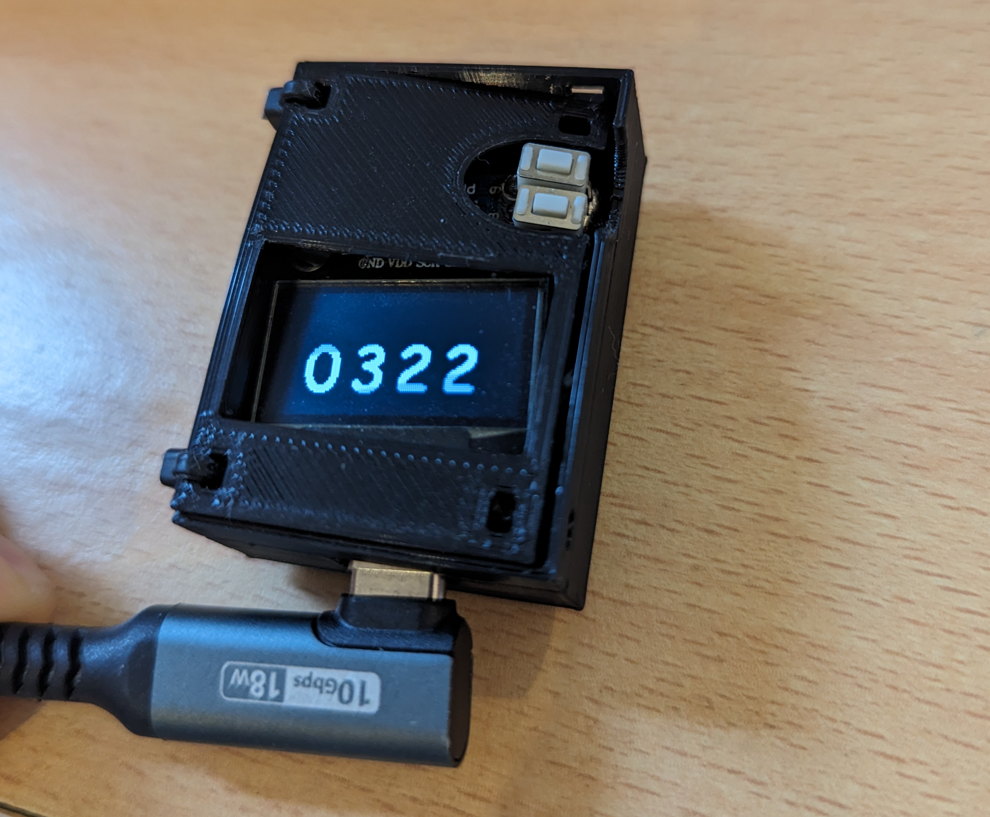
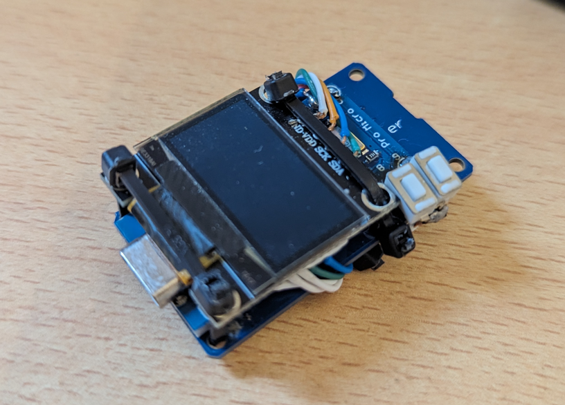
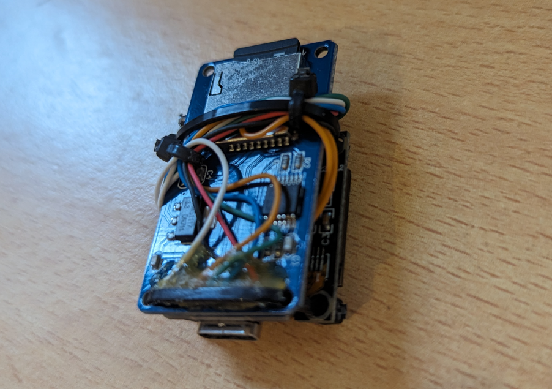

# Arduino Password Injector

Ce projet Arduino permet de simuler un clavier pour injecter un mot de passe dans un ordinateur. L'appareil utilise un écran pour afficher un code PIN à 4 chiffres, qui détermine le mot de passe injecté. Deux boutons permettent de sélectionner le code PIN, générant ainsi un mot de passe différent en fonction du code saisi.

## Utilisation
Définir le Code PIN: Utilisez les boutons pour définir un code PIN à 4 chiffres. Chaque bouton a une fonction différente (incrémenter le chiffre actuel ou passer au chiffre suivant).
Injection de Mot de Passe: Une fois le code PIN défini, l'appareil lit le mot de passe correspondant à partir de la carte SD, le transforme avec le code PIN, et l'injecte comme s'il provenait d'un clavier.
Sécurité
Le mot de passe est stocké sous forme chiffrée sur la carte SD.
Chaque code PIN génère un mot de passe différent grâce à la fonction XOR.

## Fonctionnalités

- Simulation de Clavier: L'Arduino se comporte comme un clavier pour injecter des séquences de caractères dans un ordinateur.
- Écran d'Affichage: Affiche le code PIN actuel.
- Sélection du Code PIN: Utilisez deux boutons pour définir un code PIN à 4 chiffres.
- Génération de Mot de Passe: Le mot de passe est déterminé par le code PIN et est récupéré d'un fichier stocké sur une carte SD.
- Sécurité: Utilise une fonction XOR pour varier le mot de passe en fonction du code PIN.

## Matériel Requis
Arduino (modèle avec support USB pour simulation de clavier)
Écran SSD1306 (ou compatible)
Carte SD et module de lecteur de carte SD
2 boutons poussoirs
Résistances pour les boutons (si nécessaire)
Câbles et breadboard

## Branchement

Écran SSD1306: Connectez l'écran à l'Arduino via I2C.
Lecteur de Carte SD: Branchez le module de carte SD sur le port SPI de l'Arduino.
Boutons: Connectez les boutons aux broches définies dans le code (par défaut, 9 et 8).
LEDs: (Optionnel) Utilisez des LEDs pour le retour visuel lors de l'appui sur les boutons.

## Installation

Assurez-vous d'avoir l'environnement Arduino IDE installé.
Installez les bibliothèques nécessaires: KeyboardAzertyFr, SPI, SD, et ssd1306.
Téléchargez le code source et ouvrez-le avec l'IDE Arduino.
Téléversez le code sur votre Arduino.

### lien utiles

https://github.com/martin-leo/KeyboardAzertyFr

https://forum.arduino.cc/t/librairie-keyboard-utilisation-explication-et-conversion-azerty/530938/2

